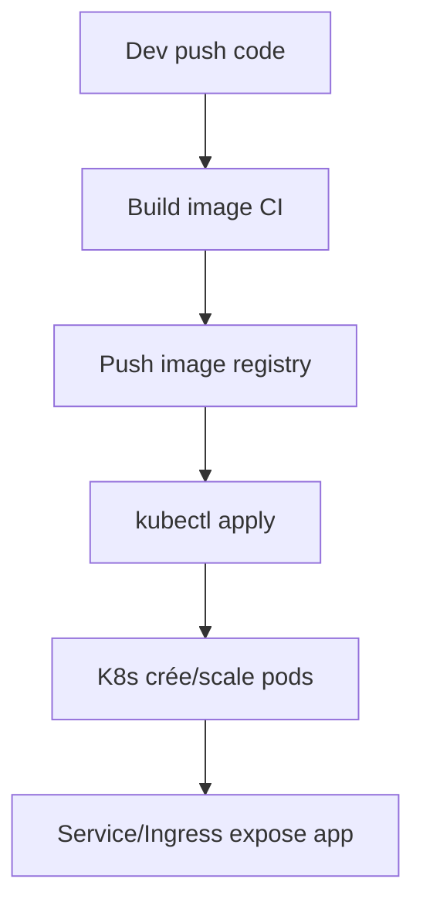

# Fiche de révision : Docker & Kubernetes (bases et avancé)

---

## Docker

- Images, containers, Dockerfile, volumes, réseaux, docker-compose.
- Commandes clés : `docker build`, `docker run`, `docker ps`, `docker exec`, `docker-compose up`.

### Concepts clés

- **Image** : snapshot exécutable d’une app (instructions dans un Dockerfile).
- **Container** : instance isolée d’une image.
- **Dockerfile** : script de build d’image.
- **Volume** : stockage persistant partagé entre host/container.
- **Réseau** : bridge, host, overlay (multi-host).
- **docker-compose** : orchestrer plusieurs containers (dev/test).

### Exemple Dockerfile

```dockerfile
FROM openjdk:17-jdk-alpine
WORKDIR /app
COPY target/app.jar app.jar
ENTRYPOINT ["java", "-jar", "app.jar"]
```

### Exemple docker-compose.yml

```yaml
version: '3.8'
services:
  db:
    image: postgres:15
    environment:
      POSTGRES_PASSWORD: example
  app:
    build: .
    ports:
      - "8080:8080"
    depends_on:
      - db
```

### Astuce entretien

- Savoir écrire un Dockerfile simple, expliquer chaque instruction.
- Différence entre image (immutable) et container (état, runtime).
- Utilité des volumes pour la persistance.

---

## Kubernetes

- Objets : Pod, Deployment, Service, ConfigMap, Secret, Ingress.
- Déploiement : `kubectl apply`, rolling update, readiness/liveness probe.
- Helm, namespaces, RBAC, security context.

### Concepts clés Kubernetes

- **Pod** : plus petite unité déployable (1+ containers).
- **Deployment** : gestion du cycle de vie des pods (scaling, rolling update).
- **Service** : expose un ou plusieurs pods (ClusterIP, NodePort, LoadBalancer).
- **ConfigMap/Secret** : config/env et secrets injectés dans les pods.
- **Ingress** : expose des services HTTP(S) en entrée du cluster.
- **Helm** : gestionnaire de packages (charts).
- **RBAC** : contrôle d’accès par rôle.

### Exemple manifest Deployment

```yaml
apiVersion: apps/v1
kind: Deployment
metadata:
  name: my-app
spec:
  replicas: 3
  selector:
    matchLabels:
      app: my-app
  template:
    metadata:
      labels:
        app: my-app
    spec:
      containers:
        - name: app
          image: myrepo/app:latest
          ports:
            - containerPort: 8080
```

### Exemple Service + Ingress

```yaml
apiVersion: v1
kind: Service
metadata:
  name: my-app-svc
spec:
  selector:
    app: my-app
  ports:
    - port: 80
      targetPort: 8080
  type: ClusterIP
---
apiVersion: networking.k8s.io/v1
kind: Ingress
metadata:
  name: my-app-ingress
spec:
  rules:
    - host: myapp.local
      http:
        paths:
          - path: /
            pathType: Prefix
            backend:
              service:
                name: my-app-svc
                port:
                  number: 80
```

### Schéma mermaid : cycle de déploiement



### Astuces entretien

- Expliquer la différence entre Deployment et Pod.
- Savoir exposer un service avec Ingress.
- Savoir utiliser ConfigMap/Secret pour la config.
- RBAC : donner un exemple d’accès restreint.

---

## Quiz rapide

- À quoi sert un ConfigMap ?
  - À injecter de la configuration non sensible dans les pods.
- Comment scaler un Deployment ?
  - `kubectl scale deployment my-app --replicas=5` ou modifier le champ `replicas`.
- Différence entre volume Docker et PersistentVolume K8s ?
  - Volume Docker : persistance locale/container. PersistentVolume : abstraction de stockage (cloud, NFS, etc.) gérée par K8s, découplée du pod.

---

## Questions d’entretien & cas pratiques

- **Écrire un Dockerfile pour une app Java.**
- **Décrire le cycle de déploiement CI/CD avec Docker & K8s.**
- **Expliquer comment sécuriser un cluster K8s (RBAC, NetworkPolicy, Secret).**
- **Donner un exemple de rolling update.**
- **Comment debugger un pod en crashloop ?**
- **Différence entre Service ClusterIP, NodePort, LoadBalancer ?**
- **Expliquer le rôle d’Ingress.**
- **Comment injecter une variable d’environnement dans un pod ?**
- **Expliquer l’intérêt de Helm.**
- **Donner un exemple de readiness/liveness probe.**

---

## Réponses types (synthétiques)

- **Dockerfile Java** : voir exemple plus haut.
- **Cycle CI/CD** : build image → push registry → déploiement K8s → pods créés/scalés → service exposé.
- **Sécuriser K8s** : RBAC pour limiter les droits, NetworkPolicy pour isoler le réseau, Secret pour les infos sensibles.
- **Rolling update** : modifier l’image dans le Deployment, K8s remplace les pods progressivement.
- **Debugger pod** : `kubectl logs`, `kubectl describe pod`, `kubectl exec -it`.
- **Types de Service** : ClusterIP (interne), NodePort (externe via port du nœud), LoadBalancer (IP publique via cloud).
- **Ingress** : expose des services HTTP(S) avec routage, TLS, virtual host.
- **Variable d’env** : via `env` dans le manifest ou ConfigMap/Secret.
- **Helm** : templating, réutilisation, gestion des dépendances.
- **Readiness/liveness probe** :

```yaml
livenessProbe:
  httpGet:
    path: /health
    port: 8080
  initialDelaySeconds: 10
  periodSeconds: 5
```
