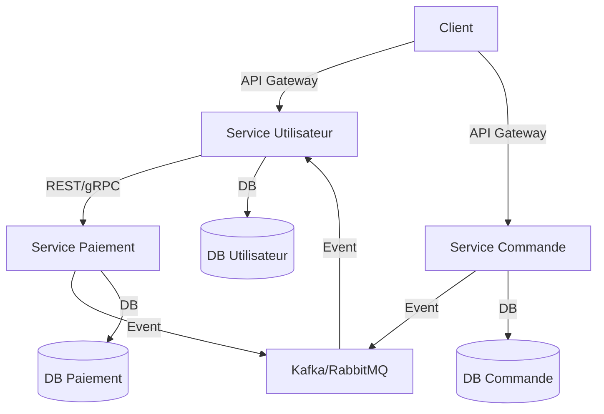

# Fiche de révision : Microservices & Architecture distribuée

---

## Concepts clés

- **Microservices** :
  - Décomposition d’une application en services indépendants, chaque service a sa propre base de données et API.
  - Permet la scalabilité, l’autonomie des équipes, le déploiement indépendant, la résilience.
  - Inconvénients : complexité, gestion du réseau, cohérence des données, monitoring.

- **Communication inter-services** :
  - Synchrone : REST, gRPC (RPC performant, typé), GraphQL.
  - Asynchrone : messaging (Kafka, RabbitMQ, SQS), events, pub/sub.
  - API Gateway : point d’entrée unique, gestion de la sécurité, du routage, du throttling.
  - Service Discovery : registre (Eureka, Consul, etcd) pour localiser dynamiquement les services.

- **Patterns d’architecture** :
  - **Circuit Breaker** : coupe les appels vers un service en échec pour éviter la propagation de la panne (Resilience4j, Hystrix).

    **Exemple Java (Resilience4j)** :

    ```java
    // Déclaration d’un circuit breaker
    CircuitBreaker circuitBreaker = CircuitBreaker.ofDefaults("serviceA");
    Supplier<String> decoratedSupplier =
      CircuitBreaker.decorateSupplier(circuitBreaker, () -> serviceA.call());
    String result = Try.ofSupplier(decoratedSupplier)
      .recover(throwable -> "fallback").get();
    ```

    **Schéma séquence** :

    ```mermaid
    sequenceDiagram
      participant Client
      participant ServiceA
      participant ServiceB
      Client->>ServiceA: Appel
      ServiceA->>ServiceB: Appel
      alt ServiceB KO
        ServiceA-->>Client: Circuit ouvert, fallback
      else ServiceB OK
        ServiceA-->>Client: Réponse normale
      end
    ```

  - **Saga** : gestion des transactions distribuées par enchaînement d’événements et de compensations.

    **Schéma séquence (chorégraphie)** :

    ```mermaid
    sequenceDiagram
      participant ServiceCommande
      participant ServicePaiement
      participant ServiceLivraison
      ServiceCommande->>ServicePaiement: Event CommandeCréée
      ServicePaiement->>ServiceLivraison: Event PaiementValidé
      ServiceLivraison->>ServiceCommande: Event LivraisonEffectuée
    ```

    **Pseudo-code orchestration** :

    ```java
    // Orchestrateur central
    if (paiementOK) {
      livraison();
    } else {
      compensationPaiement();
    }
    ```

  - **Event Sourcing** : stocker l’historique des événements plutôt que l’état courant.

    **Exemple d’événement** :

    ```json
    { "type": "CompteCrée", "data": { "id": 1, "solde": 0 } }
    { "type": "DébitEffectué", "data": { "id": 1, "montant": 100 } }
    ```

    **Reconstruction d’état** :

    ```java
    int solde = 0;
    for (Evenement evt : evenements) {
      if (evt.type == "DébitEffectué") solde -= evt.montant;
      if (evt.type == "CréditEffectué") solde += evt.montant;
    }
    ```

  - **CQRS** : séparer les modèles de lecture (Query) et d’écriture (Command) pour optimiser la scalabilité.

    **Schéma** :

    ```mermaid
    graph LR
      A[Client] -- Command --> B[Write Model]
      A -- Query --> C[Read Model]
      B -- Event --> C
    ```

    **Exemple Java** :

    ```java
    // CommandHandler
    void handle(CreateUserCommand cmd) { repository.save(cmd.user); }
    // QueryHandler
    User handle(GetUserQuery query) { return readDb.find(query.id); }
    ```

  - **API Gateway** : centralise l’accès, la sécurité, le monitoring, le throttling.

    **Exemple YAML (Kong)** :

    ```yaml
    routes:
      - name: user-service
        paths: ["/users"]
        service: user-service
    plugins:
      - name: rate-limiting
        config:
          minute: 20
    ```

    **Exemple Nginx** :

    ```nginx
    location /api/ {
      proxy_pass http://microservices-cluster;
      proxy_set_header Authorization $http_authorization;
    }
    ```

- **Gestion de la cohérence** :
  - Cohérence forte difficile à garantir (CAP theorem), on privilégie souvent la cohérence éventuelle.
  - Idempotence : garantir qu’un même message traité plusieurs fois n’a qu’un seul effet.
  - Transactions distribuées : SAGA, 2PC (rarement utilisé en microservices).

- **Observabilité & monitoring** :
  - Centralisation des logs (ELK, Loki), traçabilité des requêtes (tracing distribué : Jaeger, Zipkin, OpenTelemetry), métriques (Prometheus, Grafana).

- **Déploiement & résilience** :
  - Conteneurisation (Docker), orchestration (Kubernetes), auto-scaling, rolling update, blue/green, canary, retry, timeout.

---

## Schéma : Architecture microservices (exemple)



---

## Astuces entretien & réponses types

- **Avantages microservices vs monolithe** :
  - Scalabilité, déploiement indépendant, tolérance aux pannes, choix technos variés, équipes autonomes.
  - Inconvénients : complexité, cohérence, monitoring, latence réseau, gestion des versions.

- **Pourquoi un message broker ?**
  - Découpler les services, absorber les pics de charge, garantir la livraison, permettre l’asynchrone.

- **Qu’est-ce qu’un Circuit Breaker ?**
  - Pattern qui coupe les appels vers un service en échec pour éviter la propagation de la panne.

- **Comment gérer la découverte de services ?**
  - Utiliser un registre (Eureka, Consul, etcd), les services s’enregistrent et se découvrent dynamiquement.

- **Comment garantir la cohérence des données ?**
  - Utiliser la cohérence éventuelle, SAGA, idempotence, events, compensation.

- **Expliquer le pattern Saga** :
  - Orchestration ou chorégraphie d’événements pour gérer des transactions distribuées sans verrou global.

- **Expliquer le pattern Event Sourcing** :
  - Stocker tous les événements qui modifient l’état, reconstruire l’état à partir de l’historique.

- **Expliquer le pattern CQRS** :
  - Séparer les modèles de lecture et d’écriture pour optimiser la performance et la scalabilité.

- **Pourquoi une API Gateway ?**
  - Centraliser la sécurité, le routage, le monitoring, le throttling, simplifier le client.

---

## Questions d'entretien & cas pratiques (avec réponses synthétiques)

- **Qu’est-ce qu’un Circuit Breaker ?**
  - Pattern qui coupe les appels vers un service en échec pour éviter la propagation de la panne.

- **Comment gérer la découverte de services ?**
  - Registre (Eureka, Consul, etcd), services s’enregistrent et se découvrent dynamiquement.

- **Pourquoi utiliser un message broker ?**
  - Pour découpler les services, absorber les pics de charge, garantir la livraison, permettre l’asynchrone.

- **Comment garantir la cohérence des données ?**
  - Cohérence éventuelle, SAGA, idempotence, events, compensation.

- **Expliquer le pattern Saga.**
  - Orchestration ou chorégraphie d’événements pour gérer des transactions distribuées sans verrou global.

- **Expliquer le pattern Event Sourcing.**
  - Stocker tous les événements qui modifient l’état, reconstruire l’état à partir de l’historique.

- **Expliquer le pattern CQRS.**
  - Séparer les modèles de lecture et d’écriture pour optimiser la performance et la scalabilité.

- **Pourquoi une API Gateway ?**
  - Centraliser la sécurité, le routage, le monitoring, le throttling, simplifier le client.

- **Comment monitorer une architecture microservices ?**
  - Centralisation des logs, tracing distribué, métriques, alertes.

- **Comment déployer des microservices de façon résiliente ?**
  - Conteneurisation, orchestration (K8s), auto-scaling, rolling update, blue/green, canary, retry, timeout.
