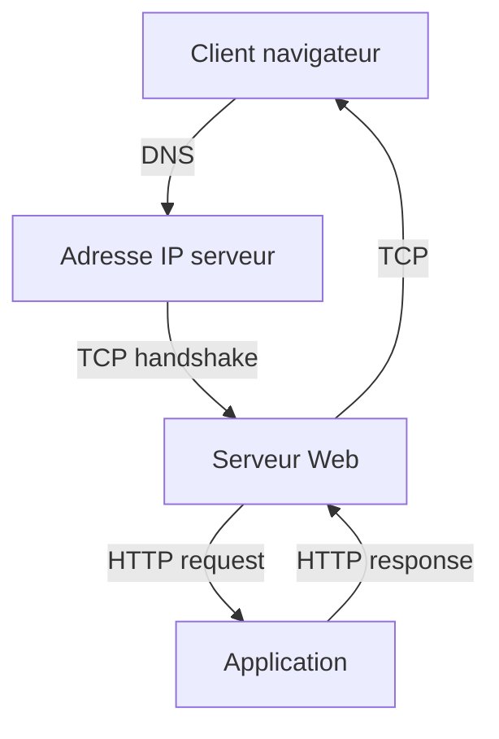

# Fiche de révision : Réseau & HTTP pour devs

---

## Concepts clés

- **Modèle OSI & TCP/IP** :
  - OSI : 7 couches (physique, liaison, réseau, transport, session, présentation, application). Permet de structurer la communication réseau et de diagnostiquer les problèmes.
  - TCP/IP : 4 couches (accès réseau, internet, transport, application). Modèle utilisé sur Internet.

- **Protocoles** :
  - **TCP** : Fiable, orienté connexion, garantit l’ordre et la livraison (ex : HTTP, SSH, SMTP).
  - **UDP** : Non fiable, sans connexion, rapide, pas d’accusé de réception (ex : DNS, VoIP, streaming vidéo).
  - **HTTP/HTTPS** : Protocole du web, HTTPS ajoute le chiffrement TLS.
  - **WebSocket** : Permet une communication bidirectionnelle temps réel (ex : chat, notifications live).
  - **Ports standards** : 80 (HTTP), 443 (HTTPS), 22 (SSH), 3306 (MySQL), 5432 (Postgres).

- **HTTP** :
  - **Méthodes** :
    - GET (lecture), POST (création), PUT (remplacement), PATCH (modification partielle), DELETE (suppression), OPTIONS (capabilités), HEAD (en-têtes sans corps).
    - Exemples :
      - GET :
        ```bash
        curl -X GET "https://api.example.com/users"
        ```
      - POST :
        ```bash
        curl -X POST "https://api.example.com/users" -H "Content-Type: application/json" -d '{"name":"Bob"}'
        ```
      - PUT :
        ```bash
        curl -X PUT "https://api.example.com/users/1" -H "Content-Type: application/json" -d '{"name":"Alice"}'
        ```
      - DELETE :
        ```bash
        curl -X DELETE "https://api.example.com/users/1"
        ```
  - **Statuts** :
    - 2xx (succès) :
      - 200 OK : requête réussie.
      - 201 Created : ressource créée (POST).
      - 204 No Content : succès sans contenu (DELETE).
    - 3xx (redirection) :
      - 301 Moved Permanently, 302 Found, 304 Not Modified.
    - 4xx (erreur client) :
      - 400 Bad Request : requête invalide (syntaxe, données).
      - 401 Unauthorized : authentification requise ou échouée.
      - 403 Forbidden : accès refusé malgré authentification.
      - 404 Not Found : ressource inexistante.
      - 405 Method Not Allowed : méthode HTTP non supportée.
      - 429 Too Many Requests : rate limiting.
    - 5xx (erreur serveur) :
      - 500 Internal Server Error : erreur interne serveur.
      - 502 Bad Gateway : proxy/reverse proxy reçoit une mauvaise réponse.
      - 503 Service Unavailable : service indisponible (maintenance, surcharge).
      - 504 Gateway Timeout : délai dépassé côté proxy.
  - **Headers** :
    - Content-Type (type de contenu), Authorization (authentification), Accept (formats acceptés), Cookie/Set-Cookie (sessions), Cache-Control (cache), CORS (contrôle cross-domain).
    - Exemples :
      - `Content-Type: application/json`
      - `Authorization: Bearer <token>`
      - `Access-Control-Allow-Origin: *`
  - **Cookies & Sessions** :
    - Cookie = donnée stockée côté client, envoyée à chaque requête. Sert à la session, l’authentification, le tracking.
    - Authentification stateless : JWT dans le header Authorization.
  - **CORS (Cross-Origin Resource Sharing)** :
    - Contrôle l’accès aux ressources depuis d’autres domaines. Headers : Access-Control-Allow-Origin, etc.

- **WebSockets** :
  - Permet une connexion persistante et bidirectionnelle entre client et serveur. Utilisé pour le temps réel (chat, jeux, notifications).

- **Load balancing & reverse proxy** :
  - **Load balancer** : Répartit la charge entre plusieurs serveurs pour la scalabilité et la tolérance aux pannes (ex : Nginx, HAProxy, ELB AWS).
  - **Reverse proxy** : Intermédiaire qui relaie les requêtes, gère SSL, cache, sécurité, redirections (ex : Nginx, Traefik).

- **CDN (Content Delivery Network)** :
  - Réseau mondial de serveurs qui distribue le contenu statique (images, JS, CSS) au plus près de l’utilisateur pour accélérer le chargement et absorber les pics de trafic (ex : Cloudflare, Akamai).

- **DNS** :
  - Système qui traduit un nom de domaine (ex : google.com) en adresse IP. Permet la redondance, le load balancing, la migration transparente.

- **Sécurité réseau** :
  - **HTTPS (TLS)** : Chiffrement des échanges, authentification du serveur, intégrité des données.
  - **Certificats** : Preuve d’identité du serveur, délivrés par une autorité de certification (CA).
  - **Erreurs HTTPS fréquentes** :
    - `NET::ERR_CERT_AUTHORITY_INVALID` : certificat non reconnu (auto-signé ou CA inconnue).
    - `NET::ERR_CERT_DATE_INVALID` : certificat expiré ou horloge système incorrecte.
    - `NET::ERR_CERT_COMMON_NAME_INVALID` : nom de domaine ne correspond pas au certificat.
    - `SSLHandshakeException` (Java) : problème lors de la négociation TLS (certificat, protocole, etc.).
    - `ERR_SSL_PROTOCOL_ERROR` : protocole TLS non supporté ou mal configuré.
  - **Bonnes pratiques** :
    - Toujours utiliser HTTPS en production.
    - Renouveler les certificats avant expiration.
    - Utiliser HSTS, CSP, et des certificats wildcard/Let's Encrypt si possible.

---

## Schéma : cycle d’une requête HTTP



---

## Astuces entretien & réponses types

- **Expliquer CORS** :
  - Mécanisme de sécurité qui limite les requêtes cross-domain. Contrôlé par le header `Access-Control-Allow-Origin`.

- **Différence TCP/UDP** :
  - TCP = fiable, ordonné, accusé de réception (ex : HTTP, SSH). UDP = rapide, non fiable, pas d’accusé (ex : DNS, streaming).

- **À quoi sert un CDN ?**
  - Accélérer la distribution de contenu statique, réduire la latence, absorber les pics de trafic.

- **Qu’est-ce qu’un reverse proxy ?**
  - Serveur intermédiaire qui relaie les requêtes vers un ou plusieurs serveurs backend, gère SSL, cache, sécurité.

- **Expliquer le modèle client/serveur** :
  - Le client envoie des requêtes, le serveur répond. Architecture de base du web.

- **Exemple de requête HTTP avec curl** :

```bash
curl -X GET "https://api.example.com/users" -H "Authorization: Bearer <token>"
```

- **Expliquer le rôle d’un header HTTP** :
  - Métadonnée transmise avec la requête/réponse (ex : Content-Type, Authorization).

- **Comment fonctionne HTTPS ?**
  - Chiffrement via TLS, échange de certificats, garantit la confidentialité et l’intégrité.

- **Qu’est-ce qu’un cookie ?**
  - Donnée stockée côté client, envoyée à chaque requête, sert à la session, l’authentification, le tracking.

---

## Questions d'entretien & cas pratiques (avec réponses synthétiques)

- **Qu’est-ce que CORS ?**
  - Mécanisme de sécurité qui limite les requêtes cross-domain, contrôlé par le serveur via des headers.

- **Différence entre TCP et UDP ?**
  - TCP = fiable, ordonné, accusé de réception. UDP = rapide, non fiable, pas d’accusé.

- **À quoi sert un CDN ?**
  - Accélérer la distribution de contenu statique, réduire la latence.

- **Qu’est-ce qu’un reverse proxy ?**
  - Serveur intermédiaire qui relaie les requêtes, gère SSL, cache, sécurité.

- **Expliquer le cycle d’une requête HTTP.**
  - Résolution DNS → connexion TCP → requête HTTP → réponse HTTP → fermeture connexion.

- **Comment sécuriser une API HTTP ?**
  - HTTPS, authentification, rate limiting, CORS, validation des entrées, firewall.

- **Qu’est-ce qu’un header Authorization ?**
  - Header HTTP qui transporte le token d’authentification (ex : Bearer JWT).

- **Comment fonctionne le load balancing ?**
  - Répartit les requêtes entre plusieurs serveurs pour la scalabilité et la résilience.

- **Qu’est-ce qu’un WebSocket ?**
  - Protocole pour communication bidirectionnelle temps réel sur une connexion TCP persistante.

- **À quoi sert le DNS ?**
  - À traduire un nom de domaine en adresse IP.
