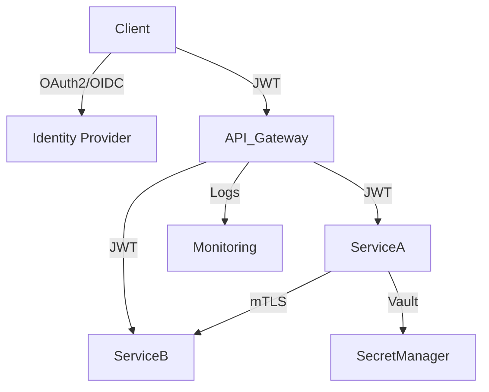

# Fiche de révision : Sécurité applicative moderne

---

## Sommaire

- [Fiche de révision : Sécurité applicative moderne](#fiche-de-révision--sécurité-applicative-moderne)
  - [Sommaire](#sommaire)
  - [Concepts clés](#concepts-clés)
    - [Définitions rapides](#définitions-rapides)
  - [Exemples concrets](#exemples-concrets)
    - [Authentification JWT avec Spring Security](#authentification-jwt-avec-spring-security)
    - [Protéger une API avec OAuth2 (Spring Boot)](#protéger-une-api-avec-oauth2-spring-boot)
    - [CORS (Spring Boot)](#cors-spring-boot)
    - [Input validation (Java)](#input-validation-java)
    - [Gestion des secrets (Vault CLI)](#gestion-des-secrets-vault-cli)
    - [IAM Cloud (exemple GCP)](#iam-cloud-exemple-gcp)
    - [Scan CI/CD (GitHub Actions)](#scan-cicd-github-actions)
  - [Tableau : Attaques courantes \& parades](#tableau--attaques-courantes--parades)
  - [Astuces entretien](#astuces-entretien)
  - [Quiz rapide](#quiz-rapide)
  - [Questions d’entretien \& cas pratiques](#questions-dentretien--cas-pratiques)
  - [Réponses types (synthétiques)](#réponses-types-synthétiques)
  - [Réponse type à la question : "Comment sécuriser une application en microservices ?"](#réponse-type-à-la-question--comment-sécuriser-une-application-en-microservices-)
    - [1. Méthodologie globale](#1-méthodologie-globale)
    - [2. Étapes et bonnes pratiques](#2-étapes-et-bonnes-pratiques)
    - [3. Technologies et protocoles recommandés](#3-technologies-et-protocoles-recommandés)
    - [4. Schéma mermaid : chaîne de sécurité microservices](#4-schéma-mermaid--chaîne-de-sécurité-microservices)
    - [5. Astuces entretien](#5-astuces-entretien)
  - [Réponse simple et débutant à : "Comment sécuriser une application en microservices ?"](#réponse-simple-et-débutant-à--comment-sécuriser-une-application-en-microservices-)
    - [Étapes claires à l’oral (niveau débutant)](#étapes-claires-à-loral-niveau-débutant)
    - [Exemple de réponse orale (débutant)](#exemple-de-réponse-orale-débutant)
    - [Astuce entretien](#astuce-entretien)
  - [Exemple d'étapes concrètes pour sécuriser une appli microservices Spring Boot (débutant)](#exemple-détapes-concrètes-pour-sécuriser-une-appli-microservices-spring-boot-débutant)
    - [Résumé oral](#résumé-oral)

---


## Concepts clés

- Authentification (login, JWT, OAuth2, OpenID Connect)
- Autorisation (RBAC, ABAC)
- Sécurité API (CORS, rate limiting, input validation)
- Gestion des secrets (Vault, KMS, .env)
- Sécurité CI/CD (scans, secrets, dépendances)
- Sécurité cloud (IAM, policies, audit)

### Définitions rapides

- **Authentification** : prouver l'identité d'un utilisateur (login/mot de passe, SSO, MFA).
- **Autorisation** : vérifier les droits d'accès (RBAC = rôles, ABAC = attributs).
- **JWT** : token signé contenant les claims d'identité et d'autorisation.
- **OAuth2/OpenID Connect** : délégation d'authentification/autorisation (SSO, login Google, etc.).
- **CORS** : contrôle des accès cross-domain côté navigateur.
- **Rate limiting** : limiter le nombre de requêtes pour éviter les abus.
- **Input validation** : filtrer/sécuriser les entrées utilisateur (contre XSS, injection SQL, etc.).
- **Vault/KMS** : gestion centralisée et sécurisée des secrets.
- **IAM** : gestion des identités et accès dans le cloud.

---

## Exemples concrets

### Authentification JWT avec Spring Security

```java
// Configuration d'un filtre JWT
public class JwtFilter extends OncePerRequestFilter {
  @Override
  protected void doFilterInternal(HttpServletRequest req, HttpServletResponse res, FilterChain chain)
      throws ServletException, IOException {
    String token = req.getHeader("Authorization");
    if (token != null && validate(token)) {
      // Authentifier l'utilisateur dans le contexte Spring
    }
    chain.doFilter(req, res);
  }
}
```

### Protéger une API avec OAuth2 (Spring Boot)

```yaml
spring:
  security:
    oauth2:
      resourceserver:
        jwt:
          jwk-set-uri: https://auth-server/.well-known/jwks.json
```

### CORS (Spring Boot)

```java
// Autoriser CORS sur un contrôleur
@CrossOrigin(origins = "https://mon-frontend.com")
@RestController
public class ApiController { ... }
```

### Input validation (Java)

```java
// Validation d'entrée avec Bean Validation
public class UserDto {
  @NotBlank
  @Email
  private String email;
}
```

### Gestion des secrets (Vault CLI)

```bash
vault kv put secret/app password=supersecret
vault kv get secret/app
```

### IAM Cloud (exemple GCP)

```yaml
bindings:
- role: roles/storage.objectViewer
  members:
    - user:dev@exemple.com
```

### Scan CI/CD (GitHub Actions)

```yaml
- name: Scan dépendances
  uses: actions/dependency-review-action@v3
```

---

## Tableau : Attaques courantes & parades

| Attaque         | Impact                  | Parade principale                  |
|-----------------|------------------------|------------------------------------|
| Injection SQL   | Accès/altération BDD   | Requêtes préparées, validation     |
| XSS             | Vol de session, deface | Échapper les sorties, CSP, validation |
| CSRF            | Action non voulue      | Token CSRF, SameSite cookie        |
| Brute force     | Compromission compte   | Limiter tentatives, CAPTCHA, MFA   |
| Exposition secret| Fuite d’info sensible | Stockage sécurisé, audit, rotation |

---

## Astuces entretien

- Savoir expliquer la différence authentification/autorisation.
- Citer des bonnes pratiques sécurité API :
  - Valider/saniter toutes les entrées.
  - Utiliser HTTPS partout.
  - Limiter les droits (principe du moindre privilège).
  - Stocker les secrets hors du code (Vault, KMS, variables d'env).
  - Activer le logging et l'audit.
  - Mettre à jour les dépendances (scans SCA).
- Savoir où stocker un secret en prod : Vault, KMS, Secret Manager, jamais dans le code ou le repo.

---

## Quiz rapide

- Qu’est-ce qu’un JWT ?
  - Un token signé contenant des informations d'identité et d'autorisation.
- Comment protéger une API contre l’injection SQL ?
  - Utiliser des requêtes préparées/ORM, valider les entrées.
- Où stocker un mot de passe d’application ?
  - Dans un gestionnaire de secrets (Vault, KMS, Secret Manager), jamais en dur dans le code.

---

## Questions d’entretien & cas pratiques

- **Différence authentification vs autorisation ?**
- **Citer 3 attaques courantes sur une API.**
- **Comment sécuriser un pipeline CI/CD ?**
- **Expliquer le principe du moindre privilège.**
- **Comment gérer les secrets dans un cluster Kubernetes ?**
- **Donner un exemple de validation d’entrée côté backend.**
- **Comment détecter une faille XSS ?**
- **Comment fonctionne OAuth2 ?**
- **Pourquoi utiliser HTTPS ?**
- **Comment auditer les accès à une API ?**

---

## Réponses types (synthétiques)

- **Authentification** : prouver l'identité, ex : login/mot de passe.
- **Autorisation** : vérifier les droits, ex : accès admin.
- **Attaques courantes** : injection SQL, XSS, brute force, CSRF.
- **Sécuriser CI/CD** : scanner les dépendances, stocker secrets hors du code, limiter les droits des runners.
- **Moindre privilège** : donner le minimum de droits nécessaires.
- **Secrets K8s** : utiliser Secret K8s, Vault, RBAC restrictif.
- **Validation d’entrée** : regex, type, taille, whitelist.
- **Détecter XSS** : scanner le code, tester l’injection de scripts.
- **OAuth2** : délégation d’authentification/autorisation via un provider externe.
- **HTTPS** : chiffrer les échanges, garantir l’intégrité et l’authenticité.
- **Audit API** : logs d’accès, traçabilité, alertes sur comportements suspects.

---

## Réponse type à la question : "Comment sécuriser une application en microservices ?"

### 1. Méthodologie globale

- **Approche defense-in-depth** : superposer plusieurs couches de sécurité (authentification, autorisation, réseau, monitoring, etc.).
- **Principe du moindre privilège** : chaque service, utilisateur ou composant n’a accès qu’au strict nécessaire.
- **Zero Trust** : ne jamais faire confiance par défaut, même au sein du réseau interne.
- **Automatiser la sécurité** : CI/CD avec scans, tests, gestion des secrets, audit.

### 2. Étapes et bonnes pratiques

1. **Authentification centralisée**
   - Utiliser un Identity Provider (IdP) compatible OAuth2/OpenID Connect (ex : Keycloak, Auth0, Azure AD).
   - Tous les clients (front, mobile, autres services) s’authentifient auprès de l’IdP.

2. **Autorisation déléguée**
   - Utiliser des tokens JWT signés pour transporter l’identité et les droits (scopes, rôles).
   - Chaque microservice valide le JWT (signature, expiration, scopes) avant de traiter la requête.
   - RBAC (rôles) ou ABAC (attributs) selon la granularité voulue.

3. **Sécurisation des API**
   - HTTPS obligatoire partout (TLS).
   - Rate limiting, CORS, input validation, logs d’accès, monitoring.
   - API Gateway pour centraliser la sécurité, le routage, le throttling, l’audit.

4. **Sécurité réseau**
   - Segmentation réseau (NetworkPolicy K8s, VPC, firewall).
   - Interdire les accès directs entre services non nécessaires.
   - Mutual TLS (mTLS) pour l’authentification inter-services (ex : Istio, Linkerd).

5. **Gestion des secrets**
   - Stocker les secrets dans un gestionnaire sécurisé (Vault, KMS, Secret Manager).
   - Jamais de secrets en dur dans le code ou les images Docker.

6. **Sécurité CI/CD**
   - Scanner les dépendances (SCA), les images (SAST/DAST), vérifier l’absence de secrets.
   - Limiter les droits des runners, auditer les pipelines.

7. **Audit, traçabilité, alertes**
   - Centraliser les logs, activer le tracing distribué, générer des alertes sur comportements suspects.

### 3. Technologies et protocoles recommandés

- **OAuth2 / OpenID Connect** : pour l’authentification et l’autorisation déléguée (SSO, tokens JWT).
- **JWT** : pour transporter l’identité et les droits entre services.
- **HTTPS (TLS)** : pour chiffrer tous les échanges.
- **API Gateway** : Kong, NGINX, Spring Cloud Gateway, etc.
- **mTLS** : pour l’authentification forte inter-services (Istio, Linkerd).
- **Vault, KMS, Secret Manager** : gestion des secrets.
- **Kubernetes NetworkPolicy** : segmentation réseau.
- **Outils CI/CD** : SonarQube, Trivy, Snyk, GitHub Actions, GitLab CI.

### 4. Schéma mermaid : chaîne de sécurité microservices



### 5. Astuces entretien

- Toujours citer l’authentification centralisée (OAuth2/OIDC) et la validation des JWT côté microservice.
- Expliquer l’intérêt de l’API Gateway et du mTLS.
- Insister sur la gestion des secrets et la CI/CD sécurisée.
- Mentionner la traçabilité et l’audit.
- Adapter la réponse selon le contexte (cloud, K8s, legacy, etc.).

---

## Réponse simple et débutant à : "Comment sécuriser une application en microservices ?"

### Étapes claires à l’oral (niveau débutant)

1. **Vérifier l’identité de l’utilisateur**
   - Utiliser un système de connexion centralisé (ex : login via Google, Azure, Keycloak).
   - Chaque utilisateur doit s’authentifier pour accéder à l’appli.

2. **Donner les bons droits**
   - Après connexion, donner à chaque utilisateur seulement ce qu’il a le droit de faire (ex : admin, user simple).
   - On utilise des rôles ou des permissions.

3. **Protéger les échanges**
   - Toujours utiliser HTTPS (le cadenas dans l’URL) pour que personne ne puisse lire ou modifier les données échangées.

4. **Vérifier les accès à chaque service**
   - Chaque microservice doit vérifier que la personne a le droit d’accéder à la ressource (vérifier le token d’accès).

5. **Ne jamais mettre de mots de passe ou secrets dans le code**
   - Utiliser un coffre-fort à secrets (ex : Vault, variables d’environnement, fichiers protégés).

6. **Limiter les attaques**
   - Bloquer les tentatives répétées de connexion (anti-brute force).
   - Valider toutes les données reçues (pour éviter les failles comme l’injection SQL ou XSS).

7. **Surveiller et enregistrer ce qui se passe**
   - Garder des traces (logs) de qui fait quoi, pour détecter les comportements suspects.

### Exemple de réponse orale (débutant)

> "Pour sécuriser une appli en microservices, je commence par mettre une authentification centralisée (ex : login Google ou Keycloak), puis je donne à chaque utilisateur les droits adaptés (rôles). J’utilise toujours HTTPS pour chiffrer les échanges. Chaque service vérifie le token d’accès avant de répondre. Je ne mets jamais de mots de passe dans le code, j’utilise un coffre-fort à secrets. Je bloque les attaques simples (brute force, injection) en validant les entrées et en limitant les tentatives. Enfin, je surveille les accès avec des logs pour détecter les problèmes."

### Astuce entretien

- Si tu ne connais pas un mot, explique avec tes mots : "Je vérifie qui se connecte, je donne les droits, je chiffre les échanges, je protège les mots de passe, je surveille les accès."
- Citer un outil ou une techno connue (Keycloak, HTTPS, Vault) rassure le jury, mais l’important c’est la logique.

---

## Exemple d'étapes concrètes pour sécuriser une appli microservices Spring Boot (débutant)

1. **Authentification centralisée**
   - Installer et configurer un Identity Provider (ex : Keycloak, Auth0, Azure AD).
   - Chaque utilisateur se connecte via ce service (login/mot de passe, Google, etc.).
   - Dans chaque microservice Spring Boot, ajouter la dépendance `spring-boot-starter-oauth2-resource-server`.
   - Configurer l’URL du serveur d’authentification dans `application.yml` :

```yaml
spring:
  security:
    oauth2:
      resourceserver:
        jwt:
          jwk-set-uri: https://mon-idp/.well-known/jwks.json
```

2. **Vérification des droits (autorisation)**
   - Dans le code, utiliser les annotations Spring Security pour restreindre l’accès :

```java
@RestController
public class AdminController {
  @PreAuthorize("hasRole('ADMIN')")
  @GetMapping("/admin")
  public String admin() { return "ok"; }
}
```

3. **HTTPS partout**
   - Configurer le reverse proxy (Nginx, API Gateway, Ingress K8s) pour forcer HTTPS.
   - (En local, pour tester, tu peux générer un certificat auto-signé ou utiliser `spring-boot-devtools`.)

4. **Validation des entrées**
   - Utiliser les annotations de validation Spring (`@NotBlank`, `@Email`, etc.) sur les DTOs.
   - Exemple :

```java
public class UserDto {
  @NotBlank
  @Email
  private String email;
}
```

5. **Gestion des secrets**
   - Ne jamais mettre de mot de passe ou clé dans le code ou le repo.
   - Utiliser des variables d’environnement, ou un gestionnaire de secrets (Vault, Secret Manager, K8s Secret).

6. **Limiter les attaques**
   - Ajouter un rate limiter (Spring Cloud Gateway, Resilience4j, ou configurer dans l’API Gateway).
   - Activer CORS uniquement pour les domaines autorisés.

7. **Logs et surveillance**
   - Activer les logs d’accès et d’erreur dans Spring Boot (`logging.level.org.springframework.security=DEBUG` pour debug).
   - Centraliser les logs (ELK, Loki, etc.) si possible.

### Résumé oral

> "Dans mon appli Spring Boot, je configure l’authentification centralisée avec OAuth2 (Keycloak), je protège chaque endpoint avec des rôles, je force HTTPS, je valide toutes les entrées, je stocke les secrets dans un coffre-fort, je limite les requêtes, et je surveille les accès avec les logs."
